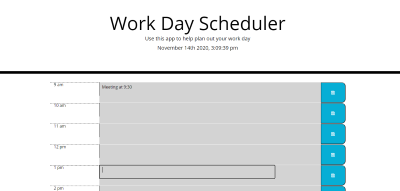

# Simple Day Planner

- View the GitHub [repository](https://github.com/Jessica264365/Simple-Day-Planner)
- View the live [website](https://jessica264365.github.io/Simple-Day-Planner/)

## Table of Contents

- [About the Project](https://github.com/Jessica264365/Simple-Day-Planner#about-the-project)
  - [Built With](https://github.com/Jessica264365/Simple-Day-Planner#built-with)

* [Start Your Own](https://github.com/Jessica264365/Simple-Day-Planner#start-your-own)
  - [Prerequisites](https://github.com/Jessica264365/Simple-Day-Planner#prerequisites)
  - [Installation](https://github.com/Jessica264365/RSimple-Day-Planner#installation)

- [License](https://github.com/Jessica264365/Simple-Day-Planner#license)
- [Roadmap](https://github.com/Jessica264365/Simple-Day-Planner#roadmap)
- [Contribute](https://github.com/Jessica264365/Simple-Day-Planner#contribute)
- [My Contact Information](https://github.com/Jessica264365/Simple-Day-Planner#my-contact-information)

## About the Project

This is a simple day planner for anyone who works a 9am to 5pm job and wants to stay organized. When the page is loaded the current date and time is displayed on the top. The user can enter any information they wish to store on the time block of their choosing. When the save button is clicked the information they entered is stored in local storage. If the user leaves the page the information will still be there. The time blocks change color depending on the hour. Past hours will be grey. The current hour will be pink and the future hours will be green. Overall this is a great simple application for anyone looking to organize their work day.

 

### Built With

For this project I used jQuery and the [Moment.js](https://momentjs.com/) api.

## Start Your Own

To get a copy of this project on your local computer please follow these next steps.

### Prerequisites

Be familier with the [jQuery](https://api.jquery.com/) and [Moment.js](https://momentjs.com/docs/) documentation.

### Installation

1. Clone the repository
   Quiz
   git@github.com:Jessica264365/Simple-Day-Planner.git

## License

MIT License

## Roadmap

This project does not currently have an open issues. Please check the [issues](https://github.com/Jessica264365/Simple-Day-Planner/issues) page on GitHub for any updates.

## Contribute

If you are interesting in contributing to this project please follow these steps:

1. Fork the project
2. Create your own branch
3. Commit your personal changes
4. Push to the branch
5. Do a pull request

## My Contact Information

Email: jwhitman135@outlook.com

GitHub Page: https://github.com/Jessica264365

Link to project: https://github.com/Jessica264365/Simple-Day-Planner
